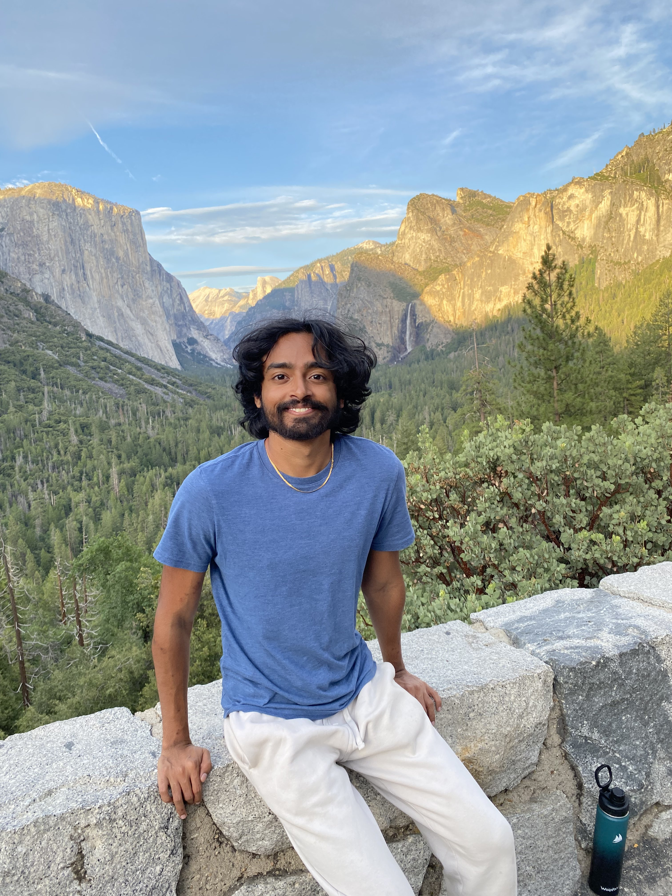
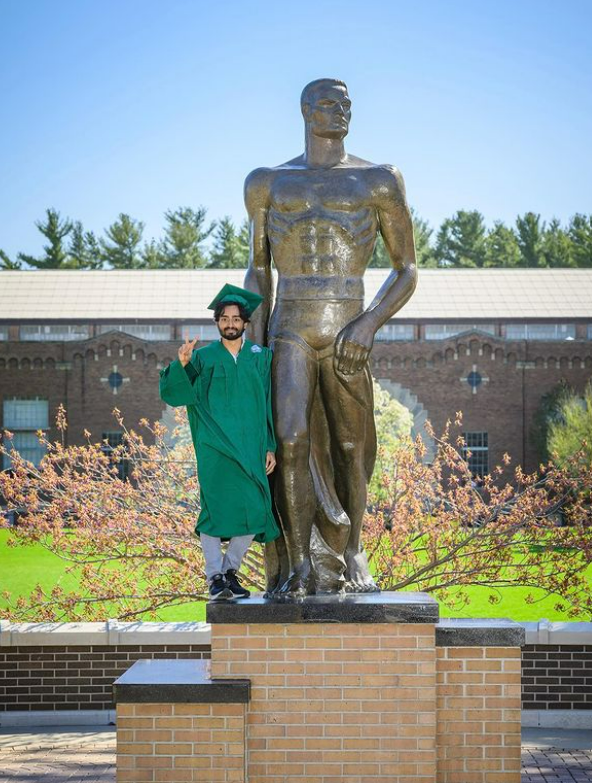
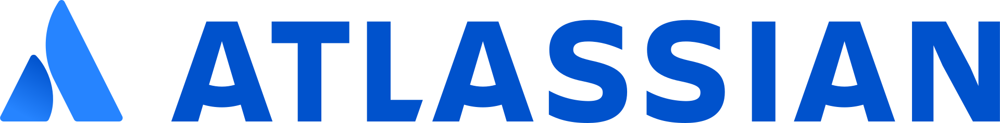

# Hi, I'm Sai! 👋

<!-- insert yosemite image -->
<!-- center image -->

  
  

<!--  -->

Welcome to my portfolio page! I'm super excited to have you along for the ride 🏄

<!-- ## Table of Contents
1. [Example](#example)
2. [Example2](#example2)
3. [Third Example](#third-example)
4. [Fourth Example](#fourth-examplehttpwwwfourthexamplecom) -->

## About Me

I am a current Master's student at MSU and aspiring data scientist. 

I am passionate about:

- 🤖 Machine Learning
- 📈 A/B Testing and Experimentation
- 📚 Using data science to drive large-scale business decisions

I am currently looking for full-time data science roles starting in Summer 2024. I would love to connect with you if you think I would be a good fit for your team!

## Companies I've Worked With
<!-- align images left to right -->

   

  
  

  

- #### [Atlassian](https://www.atlassian.com/)- Data Science Intern (Summer 2023)
- #### [Ford Motor Company](https://www.ford.com/)- Data Science Intern (Summer 2021 and Summer 2022)
- #### [Delta Dental Insurance](https://www.deltadental.com/)- Data Science Capstone Project (Spring 2022)

## Career Highlights

- Creating a novel algorithm to help Atlassian reduce A/B test runtimes by up to **60%** 📈
- Building an end-to-end machine learning workflow to predict database job runtimes in real-time at Ford Motor Company 🤖
- Using computer vision to accurately detect and map traffic objects for the Ford AV Mapping Team 🚗
- Developing a synthetic data generation pipeline to help Delta Dental improve their data science workflows 🦷

## Resume 

You can find more details about my work experience and projects in my [resume](./Sai_Ramesh_resume.pdf).
 

## 📫 How to reach me:

Please feel free to reach out to me via email or LinkedIn if you have any questions or would like to connect!

**Email**: rameshs5@msu.edu  
**LinkedIn**: [linkedin.com/in/sairamesh2432](https://linkedin.com/in/sairamesh2432)

<!--
**sairamesh2432/sairamesh2432** is a ✨ _special_ ✨ repository because its `README.md` (this file) appears on your GitHub profile.

Here are some ideas to get you started:

- 🔭 I’m currently working on ...
- 🌱 I’m currently learning ...
- 👯 I’m looking to collaborate on ...
- 🤔 I’m looking for help with ...
- 💬 Ask me about ...
- 
- 😄 Pronouns: ...
- ⚡ Fun fact: ...
-->
